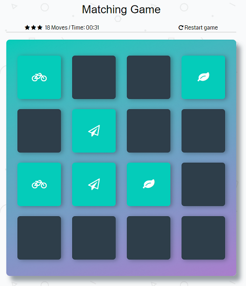

# Memory Game 2017
Memory Game is a game where you need to match pairs of tiles. Turn over one tile and then try to find a matching tile.

## Table of Contents

* [Link to a game on github Pages](#game-link)
* [Game Preview](#game-preview)
* [Description of this classic game on Wikipedia](#from-wikipedia-the-free-encyclopedia)
* [Game implementation](#implementation)
* [Technology used](#technology-used)
* [Thank you](#thank-you)

## Game link

https://igor333m.github.io/memorygame/

## Game preview

## From Wikipedia, the free encyclopedia

>Concentration, also known as Match Match, Match Up, Memory, Pelmanism, 
>Shinkei-suijaku, Pexeso or simply Pairs, is a card game in which all of the cards 
>are laid face down on a surface and two cards are flipped face up over each turn. 
>The object of the game is to turn over pairs of matching cards. Concentration 
>can be played with any number of players or as solitaire. It is a particularly 
>good game for young children, though adults may find it challenging and 
>stimulating as well. The scheme is often used in quiz shows and can be employed 
>as an educational game.

## Implementation

At the beginning of the game, timer starts to count time needed to finish the game. Game displays 5 stars rating, after some number of moves, game is removing the stars. It also count the number of moves needed to finish the game.
***
You can restart the game (shuffles the cards, restart star rating, time and moves) at any time using restart button.
At the and of the game, modal is displayed with results.

## Technology used

This game is build using HTML, CSS, JavaScript, jQuery, jQuery Transit plugin and font-awesome.
http://ricostacruz.com/jquery.transit/

http://fontawesome.io/

## Thank you

# Udacity 

For this amazing experience
